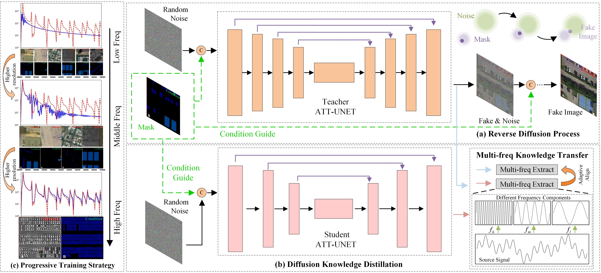

## [Controllable-Fake-Sample-Generation-for-RS](https://github.com/xiaoyuan1996/Controllable-Fake-Sample-Generation-for-RS)

##### Author: Chongyang Hao

<a href="https://github.com/xiaoyuan1996/Controllable-Fake-Sample-Generation-for-RS"></a>


<a href="https://pypi.org/project/mitype/"></a>


### -------------------------------------------------------------------------------------

### Welcome :+1:_<big>`Fork and Star`</big>_:+1:, then we'll let you know when we update

```bash
#### News:
#### 2022.12.20: ---->The code of CFSG-RS is expected to be released before next year<----
#### 2021.12.29: ---->The code of CFSG-RS has been open to access<----
#### 2021.12.30: ---->Updated usage methods and some test results<----
```

### -------------------------------------------------------------------------------------

## INTRODUCTION

This is CFSG-RS,a fake sample generation method for remote sensing images.
Here, you can get an efficient remote sensing fake sample generation  framework based on the diffusion model, which can be further modified to achieve more controllable and better generation effect.


##

## [CFSG-RS](Controllable-Fake-Sample-Generation-for-RS/README.md)

### Network Architecture


The proposed training framework for efficient and controllable remote sensing fake sample generation.
  (a) The original reverse diffusion process.
  (b) The designed diffusion distillation based on multi-frequency knowledge transfer.
  (c) Progressive training strategy for accelerated diffusion learning.

### Multi-frequency Dynamic Knowledge Distillation.

### Progressive Training Strategy


The diffusion model learns too slowly, and the general network starts from low frequency and learns high frequency. For this reason, we optimize the convolutional kernels at different scales by staging the diffusion model to learn different discriminative solutions.


## Usage

### Brief

Our code is based on [**Image Super-Resolution via Iterative Refinement(SR3)**](https://github.com/Janspiry/Image-Super-Resolution-via-Iterative-Refinement ).We apply it to the remote sensing pseudo-sample generation task and increase our innovation.

### Environment

```python
pip install -r requirement.txt
```

### Pretrained Model

We prepared three Pretrained Models, representing the regular model, the unguided lightweight model, and the tuned lightweight model. The resource consumption of the light-weighted model is much smaller than that of the regular model. The original model contains 97,807,491 parameters, while the optimized diffusion model requires only 42,054,851 parameters to complete the pseudo-sample generation task.

inception_ v3_ The google-0cc3c7bd.pth file needs to be configured in the python environment, which needs to be used when calculating fid and is

| Type                                                        | Platform（Code：hcy1)                                        |
| ----------------------------------------------------------- | ------------------------------------------------------------ |
| nomal_model                                                 | [Baidu Yun](https://pan.baidu.com/s/196aCOl0bluVj59swXMcF9w) |
| unlead_light_model                                          | [Baidu Yun]( https://pan.baidu.com/s/1DbdMx6IIbHainnZNUh2nBw) |
| leader_light_model                                          | [Baidu Yun](https://pan.baidu.com/s/1Z9JvrpfQjBd1JnmS4CdgFg) |
| inception_v3_google-0cc3c7bd.pth(use when eval FID and IS ) | [Baidu Yun](https://pan.baidu.com/s/1WriiaR156IQGQpJdsCQyNw) |

```python
# Download the pretrain model and edit [infer_256]_[leader_network].json about "resume_state":
"resume_state": [your pretrain model path]
```

### Data Prepare

#### New Start

If you didn't have the data, you can prepare it by following steps:

[*testset*]()

then you need to change the datasets config to your data path and image resolution: 

```json
"datasets": {
        "train": {
            "name": "test_process",
            "mode": "HR", // whether need LR img
            "dataroot": "/data/diffusion_data/dataset/false_generate",//train dastset root path
            "datatype": "random", //noise,random,crop，multiple,data processing method
            "l_resolution": 32,
            "r_resolution": 256, // crop size
            "batch_size": 2,
            "num_workers": 2,
            "use_shuffle": true,
            "data_len": -1 // -1 represents all data used in train
        },
        "val": {
            "name": "test_process",
            "mode": "HR",
            "dataroot": "/data/diffusion_data/val/test",//testset root path
            "datatype": "infer", //infer,random,crop，multiple,data processing method
            "l_resolution": 32,
            "r_resolution": 256,//input size
            "data_len": -1 // -1 represents all data used in test
        }
    },
```

```shell
 #Training data file structure
/data/diffusion_data/dataset/false_generate
├── hr_256 # ground-truth images.
└── sr_32_256 # mask RGB images.
```

```python
 #Test data file structure
/data/diffusion_data/val/test
├── images # ground-truth images.
└── labels # mask RGB images.
```

You can also adjust your file structure by modifying the data/LRHR_dataset.py file

```python
self.sr_path = Util.get_paths_from_images(
                '{}/labels'.format(dataroot))
self.hr_path = Util.get_paths_from_images(
                '{}/images'.format(dataroot))
```

### Test/Evaluation

```python
#Edit json to add pretrain model path and testset root path, run the evaluation 
#light_network.json corresponds to light weight model test
#infer_256.json corresponds to regular model infer
#-i controls the file storage location, step controls the number of reasoning iterations, and eta represents the noise orthogonalization ratio
python train_infer.py -c [config file] -i --steps 20 --eta 0.0
```

### Storage Path

You can change the weight file and output image storage location under the file core/logger.py

```python
    if args.infer:
        experiments_root = os.path.join(
            '/data/diffusion_data/infer', '{}_{}'.format(opt['name'], get_timestamp()))
    else:
        experiments_root = os.path.join(
            '/data/diffusion_data/experiments', '{}_{}'.format(opt['name'], get_timestamp()))
    opt['path']['experiments_root'] = experiments_root
```

### Results

Samples of Inference Process

|  |  |  |
| ------------------------------------------------------------ | ------------------------------------------------------------ | ------------------------------------------------------------ |
|  |  |  |

